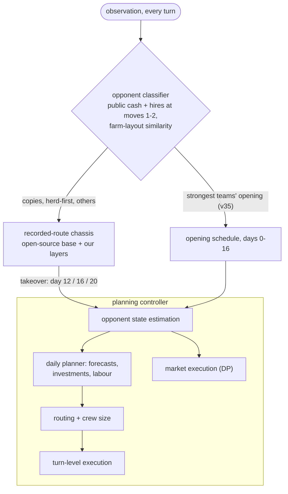

# Kaggriculture agent

Agents for [Kaggriculture](https://www.kaggle.com/competitions/kaggriculture), a Kaggle Featured simulation competition
($50k prize, 10,000+ teams). Two players run competing farms in the same town for 720 turns (30 days × 24 hours):
they plant crops, raise animals, hire workers and sell into a shared market whose prices fall with every unit sold.
The richer farm at the end wins. Each move has a 1-second budget.

**Result:** 313th of 10,148 teams (top 3.1%, inside the silver-medal range) as of 7 Oct 2026. Final standings are
published after the evaluation period ends on 14 Oct.

The full research workspace (every experiment, gate and analysis tool) is on the
[`research`](https://github.com/xantugs/kaggriculture/tree/research) branch.

## The agents

| File | Submitted as | What it is |
|---|---|---|
| [`agents/cgt_tape.py`](agents/cgt_tape.py) | v34 | Recorded-route opening, then the planning controller takes over (day 12, 16 or 20, depending on the town and the opponent). |
| [`agents/nmp44tr_controller.py`](agents/nmp44tr_controller.py) | v35 | Same base, plus an opponent classifier at move 1: against the strongest teams' current opening, the controller plays the whole game with its own opening schedule. |

Both files are self-contained (standard library only) and byte-identical to what was uploaded to Kaggle; see
[`agents/SHA256SUMS`](agents/SHA256SUMS). The readable source of their main parts is in [`agents/src/`](agents/src):
the chassis (`chassis.py`) and the planning controller in two configurations (`controller_tape.py`,
`controller_opening.py`).

## Architecture



The planning controller (`agents/src/controller_opening.py`, about 6,700 lines) owns every worker and every market order
from the takeover turn to the end of the game.

**Market execution as dynamic programming** (`_dp_sell`). Selling is a finite-horizon problem solved by backward
induction: the state is the number of units already committed, and the decision is how many to sell in each 4-turn
market window over the next 24 turns. Revenue comes from the engine's nonlinear price-impact curves (sqrt, log or hinge
regimes per product, `_gc_price`), with prefix-summed price integrals so each solve is O(K·U²). The future order book is
the town's deterministic demand schedule (`_town_draw`) plus the rival's forecast order flow. The objective is
adversarial: our revenue minus 1.5 × the rival's, because games are won on the difference. Overnight storage is a
state constraint.

**Opponent state estimation from public information only** (`_mk_track`; `_edge_phase_forecast` in the agent files).
The rival's sales each turn are recovered by inverting the change in market inventory against the known demand
(Δinventory + town demand − our own fills). Its hidden inventory is tracked by attributing each tile's yield drop to the
worker standing on it and following that worker's cargo until it reaches the shed. Its sale timing is forecast by
spreading the expected volume over the selling hours it used on its last three sale days, shifted by travel time to the
shed, plus tomorrow's output from each plant's and animal's growth phase.

**Forward market simulation for investment decisions** (`_straw_value`, `_tomato_value`, `_herd_value`, `rich_eval`).
A day-by-day simulation of the order book to the end of the game covers town demand (current shops plus expected
unlocks), every visible plant and animal on both farms through its growth schedule, and our own volume priced along the
impact curve. Each investment is sized by marginal value:
n* = argmax [R(n) − R(0) − n · (seed + inputs + labour + the tile's opportunity cost)]. Herds are valued over the
remaining game, minus what our extra supply would let the rival earn.

**Vehicle routing with workforce sizing** (`_route_and_hire`, `_vrp`, `_vrp1`, `_order`, `_plan_stops`). Every day:
up to 16 workers, 50–70 jobs, 24 turns of capacity on a Manhattan grid. Cheapest insertion runs under three priority
orderings (radial, angular sweep, value density), and the best plan is chosen lexicographically by must-do jobs missed,
value lost, then travel. Routes are improved by nearest neighbour + 2-opt and re-insertion repair, and shed stops are
inserted so the end-of-day load fits the 100-unit storage (the engine destroys overflow). This sits inside an outer
search over crew size, where the n-th hire of the day costs Fib(n); a packing pass then tries to remove hires
(`_pack_hands`).

**Turn-level execution** (`act`, `_courier`, `_rematch`, `_trim_queue`). Routes compile into per-worker action queues.
Workers hired mid-day appear wherever the engine places them, so they are re-matched to routes by exhaustive
permutation search. The shed load is projected during the day, and couriers are sent when it would overflow. When time
runs short, queues are trimmed while keeping the actions that save a plant or animal tonight.

## Measured results

| Change | Test | Result |
|---|---|---|
| Planning controller vs the recorded-route chassis alone | 249 replayed games against strong teams | win rate 50% → 74% |
| Market layer (DP sell optimiser, storage cap) | 210 replayed games against 7 top teams | win rate 28% → 34% |
| Rival sale-timing forecast fed into the DP | 80 fresh games, both seats, vs the same agent without it | 62–18 |
| Forecast-gated land investment in strawberry-rich towns | games where the rule fired | +6% income (z = 4.0 overall) |
| Rating forecast from replays | a new submission, before it played | 2,710 predicted, 2,694 final |

Every change was gated on paired comparisons (same games, same seats) before submission. Worst-case move time is under
0.65 s, with zero errors across robustness sweeps of up to 1,200 games.

## Evaluation tools

| Tool | What it does |
|---|---|
| [`eval/lean.py`](eval/lean.py) | Fast game runner, checked for exact reward equality with the official `kaggle_environments` runner. |
| [`eval/decouple.py`](eval/decouple.py) | Engine patch that gives each farm and the town their own random streams, so a candidate and its baseline face the same town on the same seed. |
| [`eval/batch4.py`](eval/batch4.py) | Closed-loop games on fixed seeds, both seats. |
| [`eval/paired.py`](eval/paired.py) | Paired comparison of two runs on the same seeds: mean difference, standard error, per-product breakdown. |
| [`eval/pinned4.py`](eval/pinned4.py) | Counterfactual replay: a candidate takes over a recorded ladder game from day N while the opponent replays its recording and the town's random events are pinned to the recorded game. |
| [`eval/elite_gate.py`](eval/elite_gate.py) | The same idea for recorded games of top teams, with repair layers for open-loop replay (`transplant.py`, `eval_elite_routes.py`, `diag_collapse.py`). |
| [`eval/hfit.py`](eval/hfit.py) | Variant vs baseline per opponent rating band, with sign tests. |
| [`eval/harness.py`](eval/harness.py) | Multi-seed local harness with independent agent instances. |
| [`eval/official_selfplay.py`](eval/official_selfplay.py) | Kaggle's validation episode, run locally. |

`pinned4.py` and `elite_gate.py` need the recorded games, which are not in this repository (see
[`docs/DATA.md`](docs/DATA.md)).

## Quick start

```bash
python -m pip install --no-deps -r requirements-eval.txt
python -m unittest discover -s tests
python eval/official_selfplay.py agents/nmp44tr_controller.py 6042
NPROC=4 python eval/batch4.py agents/cgt_tape.py agents/nmp44tr_controller.py 7100-7109 cgt_vs_nmp.jsonl 01
```

The last command plays 20 games (10 seeds, both seats) in about a minute on four cores.

## Write-ups

| Doc | Topic |
|---|---|
| [`docs/takeover-controller.md`](docs/takeover-controller.md) | The planning controller: design, every knob tested, rejected ideas |
| [`docs/elite-testbed.md`](docs/elite-testbed.md) | Replaying top teams' games as a benchmark; the market programme |
| [`docs/elite-gap.md`](docs/elite-gap.md) | Where the gap to the top teams comes from |
| [`docs/route-mining.md`](docs/route-mining.md) | Mining recorded routes from replays |
| [`docs/sell-timing.md`](docs/sell-timing.md) | Sell timing on the recorded route |
| [`docs/v13-ablations.md`](docs/v13-ablations.md) | Ablations of an early version |
| [`docs/working-log.md`](docs/working-log.md) | Working log of the final four days (27–30 Sep) |
| [`docs/DATA.md`](docs/DATA.md) | Data kept out of the repository |

## Credits

The tape chassis builds on public Apache-2.0 Kaggle notebooks; their license notices and author credits are kept in the
agent files under `agents/`.
